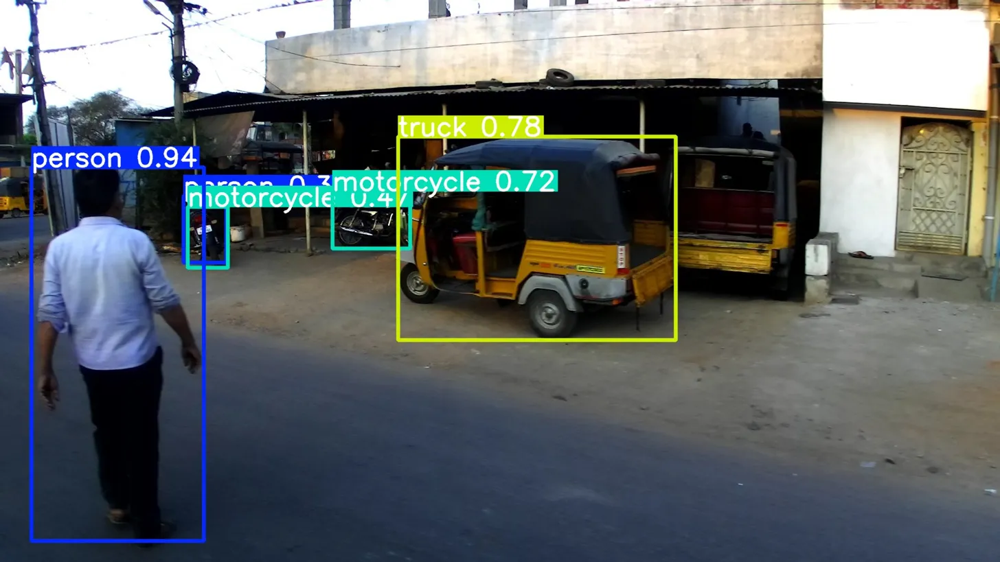
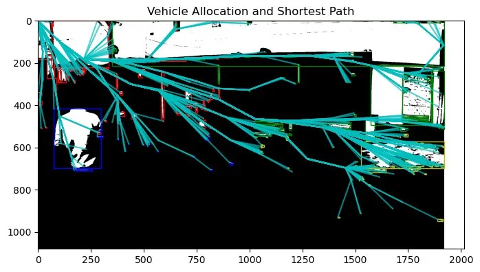
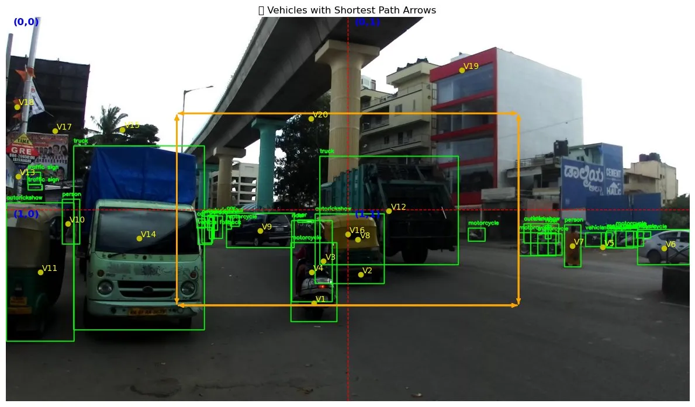
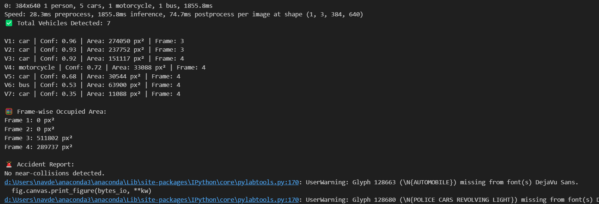
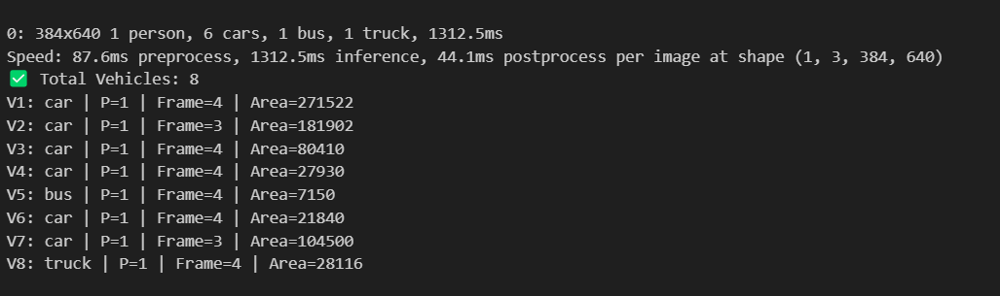
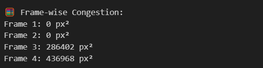

# Smart Traffic Optimization System
<p align="center">
  
  
  
</p>


## Overview

A computer vision and graph algorithm-based system designed to detect vehicles from real-world road images, estimate lane-level congestion, and compute the most optimal emergency routing paths in real time.

The system uses **YOLOv8** for vehicle detection on IDD (India Driving Dataset) images, a **grid-based congestion scoring model** to analyze traffic density per frame, and **Dijkstra's algorithm** to find the safest and fastest route for emergency vehicles like ambulances — all visualized as annotated image overlays.

This project was built to explore how AI and classical algorithms can work together to solve real-world urban traffic problems, especially in the context of Indian road conditions.

---

## Features

- **Vehicle Detection** — YOLOv8-based real-time detection on IDD dataset images
- **Congestion Estimation** — Grid-based pixel-area congestion scoring per frame
- **Shortest Path Routing** — Dijkstra's algorithm for optimal ambulance/emergency routing
- **Visual Outputs** — Annotated overlays for detection, congestion heatmaps, and path overlays

---

## Project Structure

```
smart-traffic-optimization/
├── src/
│   ├── detection.py       # YOLO vehicle detection
│   ├── congestion.py      # Grid congestion estimation
│   ├── path_planning.py   # Dijkstra shortest path
│   └── visualization.py   # Output rendering
├── demo/
│   └── demo_script.py     # End-to-end pipeline demo
├── assets/                # Sample output images
├── data/                  # Input images (not tracked in Git)
├── outputs/               # Generated results (not tracked in Git)
├── requirements.txt
└── README.md
```

---

## Setup & Run

```bash
# Install dependencies
pip install -r requirements.txt

# Run the demo pipeline
python demo/demo_script.py
```

> **Note:** Place your input image at `data/sample.jpg` before running.

---

## Demo Pipeline

The `demo/demo_script.py` runs the full end-to-end pipeline:

```python
from src.detection import detect_vehicles
from src.congestion import compute_congestion
from src.path_planning import dijkstra
from src.visualization import show_detection, show_congestion, show_path

IMAGE_PATH = "data/sample.jpg"

vehicles, image = detect_vehicles(IMAGE_PATH)
print("Vehicles detected:", len(vehicles))

congestion = compute_congestion(image, vehicles)
print("Congestion Matrix:\n", congestion)

path = dijkstra(congestion.tolist(), (1, 0), (0, 1))
print("Optimal Path:", path)

show_detection(image.copy(), vehicles)
show_congestion(congestion)
show_path(congestion, path)
```

---

## Console Outputs

<p align="center">
  <table>
    <tr>
      <td align="center"><br/><b>Vehicle Detection</b></td>
      <td align="center"><br/><b>Vehicle List</b></td>
    </tr>
    <tr>
      <td colspan="2" align="center"><br/><b>Congestion Analysis</b></td>
    </tr>
  </table>
</p>

---

## How It Works

1. **Detection** — YOLOv8 runs on the input image and returns bounding boxes for each detected vehicle.
2. **Congestion** — The image is divided into a grid; each cell is scored by the pixel area occupied by detected vehicles.
3. **Path Planning** — The congestion grid is treated as a weighted graph; Dijkstra's algorithm finds the lowest-cost path from source to destination.
4. **Visualization** — Results are rendered as annotated images and saved to `outputs/`.

---

## Requirements

See [`requirements.txt`](requirements.txt) for the full dependency list. Key libraries:

- `ultralytics` — YOLOv8
- `opencv-python` — Image processing
- `networkx` — Graph operations
- `torch` / `torchvision` — Deep learning backend

---

## Author

**## Maintainer

Baishnavi (Vai38)**

Project maintained by Vai38.

---

## License

This project is licensed under the MIT License. See [LICENSE](LICENSE) for details.
